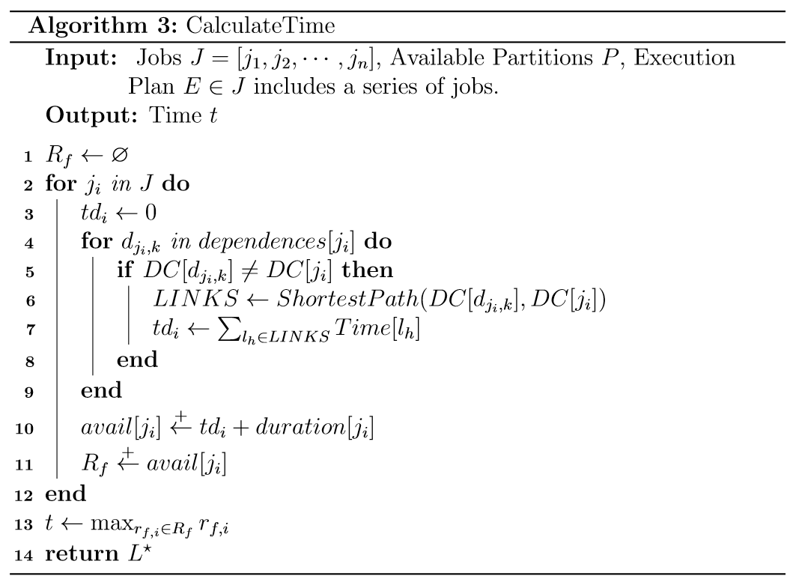
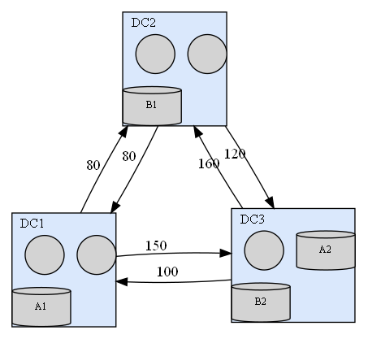

# 上海交大算法课大作业 —— Scheduling Jobs across Geo-Distributed Data Centers

## 算法

**Optimal Solution.** If we want to find the optimal solution,
and let the `dfs` algorithm finish all possibilities,
the complexity is $O(n!m!)$,
which $n$ is number of jobs, $m$ is total slot number of all datacenters.

**Approximation Solution.** If we just want to find the approximation solution,
which guaranteed at least feasible,
the complexity is $O(nm + m \log m)$,
which $n$ is number of jobs, $m$ is total slot number of all datacenters.

## Toy Data

## Simple Data

## Level2 Simple Data

[PDF Version](readme/main.pdf)